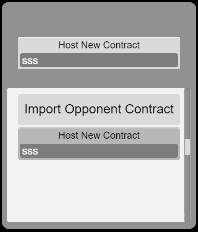
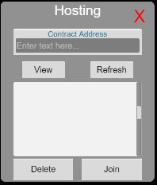
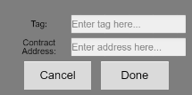
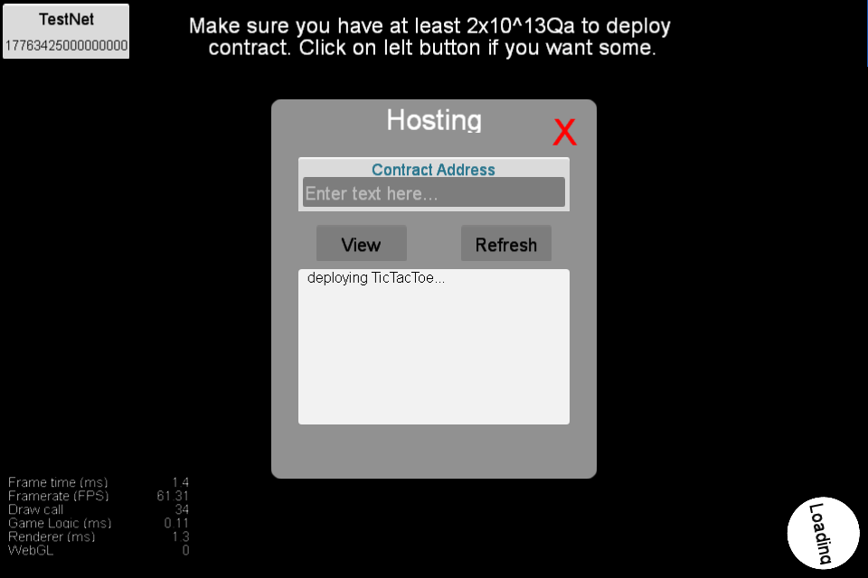
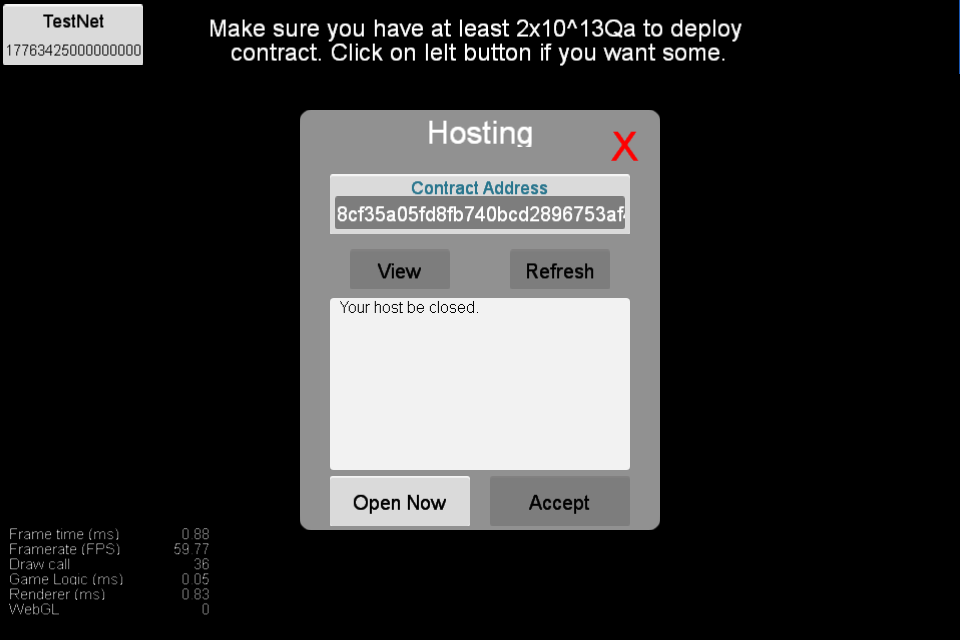
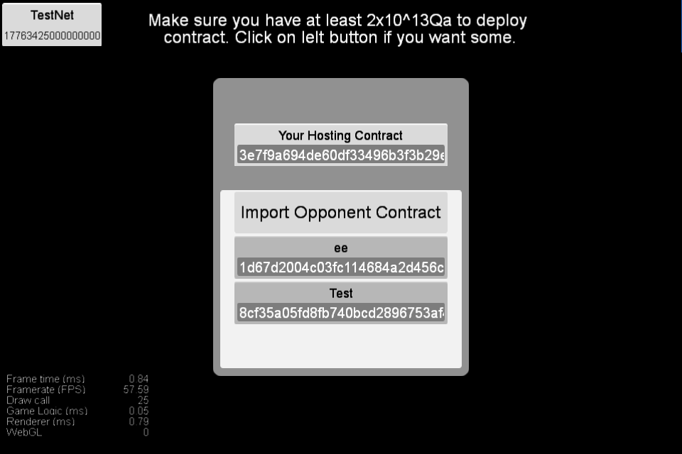
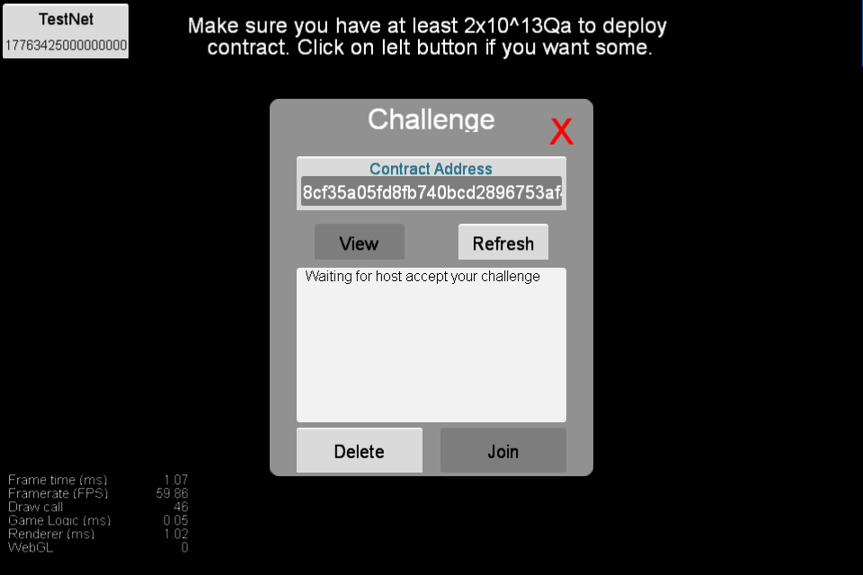

# TicTacToe
TicTacToe simplely use zilliqa cocos sdk
[Try Now](http://178.128.91.111:3000/assets/tictactoe/)

# Content:
- [1. Game flow](#1-game-flow)
- [2. Getting Started](#2-getting-started)
  * [a. Hello Zilliqa](#a-hello-zilliqa)
  * [b. Tictactoe binding](#b-tictactoe-binding)
      - [Init json](#init-json)
      - [GetSmartContractInit](#getsmartcontractinit)
      - [Binding](#binding)
      - [GetSmartContractState](#getsmartcontractstate)
      - [Call transitions](#call-transitions)
  * [c. Lobby Popup](#c-lobby-popup)
      - [UI needed](#ui-needed)
          + [Main lobby panel](#main-lobby-panel)
          + [Contract state panel](#contract-state-panel)
          + [Import contract panel](#import-contract-panel)
      - [Main actions](#main-actions)
        * [Fill Contract State](#fill-contract-state)
        * [Deploy](#deploy)
        * [Host Action](#host-action)
        * [Challenger Action](#challenger-action)
        * [Common Action](#common-action)
  * [d. Tictactoe Gameplay](#d-tictactoe-gameplay)
- [3. Demo screen](#3-demo-screen)

# 1. Game flow
* `Alice` host new contract.
* `Alice` change contract status top open. (need this step because contract state was empty until it has a transaction)
* `Alice` give the contract address to `Bob` by some way.
* `Bob` import `Alice` contract to his list.
* `Bob` clicked on `Alice` contract.
* `Bob` clicked join and waiting for `Alice` accept.
* `Alice` accept `Bob` challenge.
* Change to game screen.

# 2. Getting Started

`Hello Zilliqa` + `Tictactoe binding` + `Lobby Popup` + `Tictactoe Gameplay` = `Tictactoe dapp`\
Assume you have knowledge about cocos creator. I just focus on how to interact with contract.

## a. Hello Zilliqa
You already have this in [here](https://github.com/paladinlll/zilliqa-cocos-sdk).
## b. Tictactoe binding
* With each contract, it have different transition inside, so it need a contract binding be customized with its transitions.
* This class was be write base on the abi json. It may be generated by some way but for now let create it manual.

##### Init json
* Quick function to get init json from params.
    ```ts
    getContractInit(owner:string, checksum:string){
        return [
            // this parameter is mandatory for all init arrays
            { 
                vname : '_scilla_version',
                type : 'Uint32',
                value : '0',
            },{
                vname: 'owner',
                type: 'ByStr20',
                value: '0x' + owner.toLowerCase()
            },{
                vname: 'checksum',
                type: 'String',
                value: checksum
            },
        ];
    }
    ```
##### GetSmartContractInit
* To verify a contract is valid, or not. We'll base on getSmartContractInit.
    ```ts
    fetchInit(contract, cb: any){       
        var that = this;
        ZilliqaNetwork.getInstance().getSmartContractInit(contract.address, function(err, data) {            
            if (err) {
                cb(err, null);
            } else if (data.error) {
                cb(data.error, null);
            } else if (data.result.Error) {
                cb(data.result.Error, null);
            } else {                                
                var stateInit = ScillaDataParser.convertToSimpleJson(data.result);                   
                that.contractInit = stateInit;
                cb(null, stateInit);
            }            
        });
    }
    ```
##### Binding
* We can bind this class to a contract via an address or a direct contract. And the bind action just success if we can getSmartContractInit.
    ```ts
    bindFromAddress(addr:string, cb: any){
        var contract = ZilliqaNetwork.getInstance().loadContractFromAddress(addr);
        this.bindFromContract(contract, cb);
    }

    bindFromContract(contract, cb: any){
        this.address = contract.address;        
        this.contractInit = null;
        this.contractState = null;

        var that = this;
        this.fetchInit(contract, (err, data) => {
            if(err){
                cb(err, null);
            } else{                
                that.bindContract = contract;
                that.contractInit = data;
                cb(null, data);
            }
        });
    }
    ```
##### GetSmartContractState
* If the contract was binded, we can get the contract state by this.
    ```ts
    fetchState(cb: any){
        this.contractState = null;
        if(this.bindContract == null) return cb('null contract', null);

        var that = this;
        ZilliqaNetwork.getInstance().getSmartContractState(this.address, function(err, data) {
            if (err) {
                cb(err, null);
            } else if (data.error) {
                cb(data.error, null);
            } else if (data.result.Error) {
                cb(data.result.Error, null);
            } else {                                
                var stateData = ScillaDataParser.convertToSimpleJson(data.result);
                that.contractState = stateData;
                cb(null, stateData);
            }            
        });
    }
    ```
##### Call transitions
* callJoin
* callAnswerChallenge
* callChangeOpenStatus
* callMove

    *All was have same format so I just show you one for demo*
    ```ts
    callChangeOpenStatus(b:boolean, cb: any){
        if(this.bindContract == null) return cb('null contract', null);
        this.bindContract.call('changeOpenStatus', ScillaDataParser.convertToScillaDataList([{
            "vname": "b", 
            "type": "Bool",
            "value": b
        }]), {
            amount: new BN(0),
            gasPrice: new BN(1).mul(this.gasMultiplier),
            gasLimit: Long.fromNumber(2500),
        }).then((_) => {
            cb(null, 'Done');
        }).catch((err) => {                                                  
            cb(err, null);
        });
    }
    ```
## c. Lobby Popup
This was be used to deploy a contract, view contract state, invokes transitions to contract. 
#### UI needed
Create LobbyPopup with a dim layer to block input. Then create 3 sub panels.
###### Main lobby panel
* Create a host new contract and it include a label to show current hosting address. When press this, game will show the Contract state panel.
* Create a scrollview to keep the list addresses. It include a import button at top. When pressed import button game will show the Import contract panel. When pressed any address button, game will show the Contract state panel.\


###### Contract state panel
* Create a Editbox to show contract address and for easy to copy. If the init address is empty, the new contract will be deploy.
* Create a Label(scrollable) to show the contract state.
* Create a view button. If game is playing but you wasn't a player you can see the match by press this.
* Create a Refresh button to check new contract state. 
* Create a Join button just show in challenger mode.
* Create a Delete button just show in challenger mode.
* Create a Accept button (same location with Join button) just show in hosting mode.
* Create a Open/Close button (same location with Delete button) just show in hosting mode.\


###### Import contract panel
* Create a Editbox for tag field.
* Create a Editbox for address field.
* Create a Cancel button.
* Create a Done button.\


#### Main actions
##### Fill Contract State
* This function was be placed in TictactoeStatePopup.ts (Contract state panel). After you have a TicTacToeBinding (by given address or deployed new one), you can request and show the contract state.
* We has different flow for hosting and challenge
    ```ts
    fillContractState(){        
        var userAddressLowerCase = ZilliqaNetwork.getInstance().getUserAddress().toLowerCase();
        var binding = GameProfile.getInstance().activeTicTacToeBinding;
        if(binding == null){            
            return;
        }
        var stateData = binding.contractState;
        var stateInit = binding.contractInit;
        this.viewButton.interactable = false;
        this.refreshButton.interactable = false;

        if(this.isHosting()){
            this.hostingUILayer.active = true;
            this.hostingAcceptButton.interactable = false;
            this.hostingCloseButton.interactable = true;
            this.hostingChangeStateLabel.string = 'Close';            
            if(stateData == null){
                this.stateLabel.string = "Contract wasn't exits";
                this.hostingChangeStateLabel.string = 'Remove';
            } else if(stateInit.checksum != this.contractChecksum){
                this.stateLabel.string = "Contract was outdate";
                this.hostingChangeStateLabel.string = 'Remove';
            } else if(!stateData.opening){                
                if(stateData.winner_code == 0 || stateData.winner_code == null){                    
                    this.stateLabel.string = "Your host be closed.";
                } else{                    
                    this.stateLabel.string = "Lastest game was end with winner_code " + stateData.winner_code.toString();
                    this.viewButton.interactable = true;
                }                
                this.hostingChangeStateLabel.string = 'Open Now';                
            } else if(stateData.challenger != ''){
                if(stateData.accepted){
                    if(stateData.winner_code == 0){
                        this.stateLabel.string = "Playing turn " + stateData.turn.toString();;
                        cc.director.loadScene('gameplay');
                    } else{
                        this.stateLabel.string = "Game end with winner_code " + stateData.winner_code.toString();
                    }
                } else{
                    this.stateLabel.string = "You have a challenge from " + stateData.challenger + "\n" + stateData.welcome_msg;
                    this.hostingAcceptButton.interactable = true;
                }
            } else{
                this.stateLabel.string = "Waiting for a challenge...";
                this.refreshButton.interactable = true;
            }
        } else{
            this.joiningUILayer.active = true;
            this.joinningJoinButton.interactable = false;
            this.joinningDeleteButton.interactable = true;

            if(stateData == null){
                this.stateLabel.string = "Contract wasn't exits";            
            } else if(stateInit.checksum != this.contractChecksum){
                this.stateLabel.string = "Contract was outdate";                
            } else if(binding.isMyContract(userAddressLowerCase)){
                this.stateLabel.string = "Can't join your contract.";
            } else if(!stateData.opening){
                if(stateData.winner_code == 0 || stateData.winner_code == null){                    
                    this.stateLabel.string = "Closest by host.";
                } else{                    
                    this.stateLabel.string = "Lastest game was end with winner_code " + stateData.winner_code.toString();
                    this.viewButton.interactable = true;
                }                
            } else if(stateData.challenger != ''){
                if(stateData.challenger.replace('0x', '').toLowerCase() == userAddressLowerCase){
                    if(stateData.accepted){
                        if(stateData.winner_code == 0){
                            this.stateLabel.string = "Playing turn " + stateData.turn.toString();;
                            cc.director.loadScene('gameplay');
                        } else{
                            //never reach here
                            this.stateLabel.string = "Game end with winner_code " + stateData.winner_code.toString();
                        }
                    } else{
                        this.stateLabel.string = "Waiting for host accept your challenge";
                        this.refreshButton.interactable = true;
                    }
                } else{
                    this.handleError("Host was busing");
                    if(stateData.accepted){
                        this.viewButton.interactable = true;
                    }
                }
            } else{
                this.stateLabel.string = "Challenge Now!";
                this.joinningJoinButton.interactable = true;
            }
        }
    }
    ```

##### Deploy
* This function was be placed in TictactoeStatePopup.ts (Contract state panel). Was be trigger when show TictactoeStatePopup with address is empty.
* You can directly load code from resource, but it will better if you can load it via a cache *(GameProfile.ts)*.
    ```ts
   deployTicTacToe(){
        this.stateLabel.string = "deploying TicTacToe...";
        var that = this;
        this.connectingNode.active = true;
        GameProfile.getInstance().getTictactoeCode((data) => {
            if(data.code == ''){                    
                that.handleError('Code not found!');
                that.connectingNode.active = false;
                return;                
            }
            var binding = new TicTacToeBinding();
            var init = binding.getContractInit(ZilliqaNetwork.getInstance().getUserAddress(), data.checksum);

            ZilliqaNetwork.getInstance().deployContract(data.code, init, function(err, hello) {
                if (err) {                    
                    that.handleError(err);
                    that.connectingNode.active = false;
                } else {
                    GameProfile.getInstance().setActiveTicTacToeAddress(hello.address);
                    GameProfile.getInstance().activeTicTacToeBinding = binding; 
                    binding.bindFromContract(hello, (err, init) => {
                        if(err){
                            that.fillContractState();
                            that.connectingNode.active = false;
                        } else{
                            that.getContractState();
                        }        
                    });  
                    that.connectingNode.active = false;
                    that.addressText = hello.address;
                    that.addressEditBox.string = that.addressText;
                }
            });
        });        
    }
    ```
##### Host Action
* onChangeState\
    *We call transition via contract binding, I just show you one for demo*
    ```ts
    onChangeState(){
        if(!this.isHosting()) return;
        var binding = GameProfile.getInstance().activeTicTacToeBinding;        
        if(binding == null) return;
        var that = this;
        this.connectingNode.active = true;
        var new_state = !binding.contractState.opening;
        binding.callChangeOpenStatus(new_state, function(err, data) {
            that.connectingNode.active = false;
            if (err) {
                that.handleError(err);                
            } else if (data.error) {
                that.handleError(data.error);
            } else {
                that.getContractState();
            }              
        })
    }
    ```
* onAccept
* onRefuse
##### Challenger Action
* onJoin
* onDelete (not transition action)
##### Common Action
* onRefresh
* onView (not transition action)
## d. Tictactoe Gameplay
* We need a UI to show the boards state. Handle click event to invoke a move transition if in their turn.
    ```ts
    binding.callMove(cellId, function(err, data) {
        that.connectingNode.active = false;
        if (err) {
            that.handleError(err);
            that.refresh();
        } else if (data.error) {
            that.handleError(data.error);
            that.refresh();
        } else {                
            that.getContractState();
        }            
    })
    ```

# 3. Demo screen
### Host new contract



### Change contract state to open



### Import opponent contract


### Open opponent contract


### Challenge opponent



### Accept challenge


### Playing


