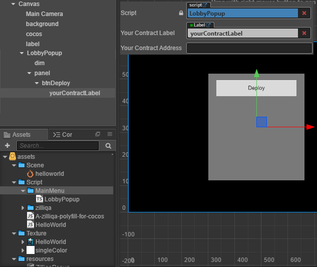
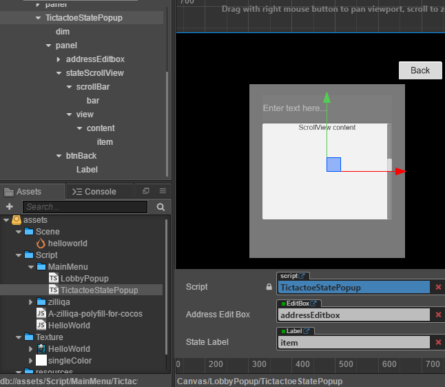
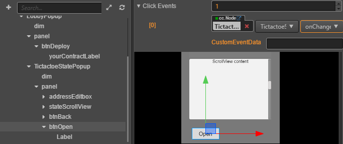
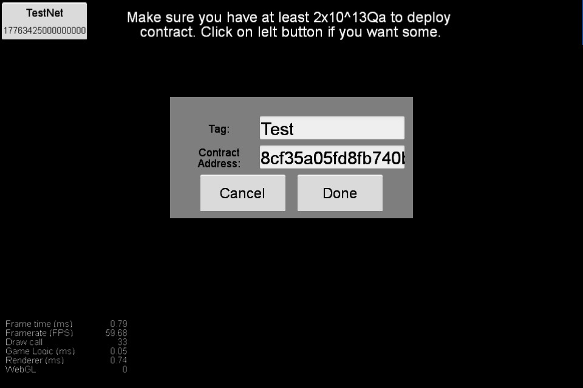

# TicTacToe
TicTacToe simplely use zilliqa cocos sdk
[Try Now](http://178.128.91.111:3000/assets/tictactoe/)

# Content:
- [1. Game flow](#1-game-flow)
- [2. Getting Started](#2-getting-started)
  * [a. Hello Zilliqa](#a-hello-zilliqa)
  * [b. Deploy contract](#b-deploy-contract)
      - [Create UI LobbyPopup:](#create-ui-lobbypopup-)
      - [Create UI TictactoeStatePopup in LobbyPopup:](#create-ui-tictactoestatepopup-in-lobbypopup-)
      - [Handle onDeploy :](#handle-ondeploy--)
  * [c. Show contract state](#c-show-contract-state)
      - [getSmartContractInit:](#getsmartcontractinit-)
      - [getSmartContractState:](#getsmartcontractstate-)
      - [Show contract state in TictactoeStatePopup:](#show-contract-state-in-tictactoestatepopup-)
  * [d. Invoke first transaction](#d-invoke-first-transaction)
  * [e. Next...](#e-next)
- [3. Demo screen](#3-demo-screen)

# 1. Game flow
* `Alice` host new contract.
* `Alice` change contract status top open. (need this step because contract state was empty until it has a transaction)
* `Alice` give the contract address to `Bob` by some way.
* `Bob` import `Alice` contract to his list.
* `Bob` clicked on `Alice` contract.
* `Bob` clicked join and waiting for `Alice` accept.
* `Alice` accept `Bob` challenge.
* Change to game screen.

# 2. Getting Started

`Hello Zilliqa` + `Tictactoe binding` + `Lobby Popup` + `Tictactoe Gameplay` = `Tictactoe dapp`\
Assume you have knowledge about cocos creator. I just focus on how to interact with contract.

## a. Hello Zilliqa
You already have this in [here](https://github.com/paladinlll/zilliqa-cocos-sdk).
## b. Deploy contract
#### Create UI LobbyPopup:


#### Create UI TictactoeStatePopup in LobbyPopup:
* Create tictactoeStatePopup property in LobbyPopup then link to TictactoeStatePopup 


#### Handle onDeploy :
* TictactoeStatePopup have function `show(address string)`. We'll link onlick event of deploy button to call that function.
```ts
    onShowStatePopup(){
        this.tictactoeStatePopup.show(this.yourContractAddress);
    }
```
* If the given address is empty we will deploy new contract (in case it's not, I'll show you later).
* I'll pass how to create a tictactoe contract. You can check at [here](https://github.com/paladinlll/zilliqa-cocos-sdk/blob/master/sample/tictactoe/assets/resources/contracts/tictactoe.scilla).
* For more easy to interact with contract, I will implement a contract binding class `TicTacToeBinding`. This class was be write base on the abi json. It may be generated by some way but for now let create it manual. At begin let implement getContractInit
```ts
export default class TicTacToeBinding{
    getContractInit(owner:string, checksum:string){
        return [{ 
                vname : '_scilla_version',
                type : 'Uint32',
                value : '0',
            },{
                vname: 'owner',
                type: 'ByStr20',
                value: '0x' + owner.toLowerCase()
            },{
                vname: 'checksum',
                type: 'String',
                value: checksum
            },
        ];
    }
}
```
* deployTicTacToe
```ts
import ZilliqaNetwork from '../zilliqa/ZilliqaNetwork'
import TicTacToeBinding from '../contracts/TicTacToeBinding';
import * as crypto from 'crypto'
@ccclass
export default class TictactoeStatePopup extends cc.Component {
    @property(cc.EditBox)
    addressEditBox: cc.EditBox = null;

    @property(cc.Label)
    stateLabel: cc.Label = null;

    contractAddress: string = '';

    // LIFE-CYCLE CALLBACKS:
    show(addr:string){
        this.node.active = true;

        if(addr == ''){
            this.deployTicTacToe();
        }
    }
   deployTicTacToe(){
        var that = this;        
        var url = cc.url.raw('resources/contracts/tictactoe.scilla');
        cc.loader.load(url, function(err, code){
            if(err){
                console.error(err);        
                return;                
            }
            
            var checksum = crypto
                .createHash('md5')
                .update(code, 'utf8')
                .digest('hex');

            var binding = new TicTacToeBinding();
            var init = binding.getContractInit(ZilliqaNetwork.getInstance().getUserAddress(), checksum);
            ZilliqaNetwork.getInstance().deployContract(code, init, function(err, ttt) {
                if (err) {                    
                    console.error(err);        
                    return;  
                } else {
                    that.addressEditBox.string = ttt.address;
                    that.contractAddress = ttt.address;
                }
            });    
        });
    }
```
*After deploy a contract, you need store the address by some way. At now let do it manual by copy it then set to yourContractAddress property (of LobbyPopup)*

## c. Show contract state
Let back to LobbyPopup. Continue, we'll handle show TictactoeStatePopup with a contract address.
#### getSmartContractInit:
* First we need verify that is a valid contract address. The idea is if we can getSmartContractInit it mean that is valid contract address (skip checksum at now). We'll implement this in TicTacToeBinding.
```ts
import ZilliqaNetwork from '../zilliqa/ZilliqaNetwork'
import {BN, Long, ScillaDataParser} from '../zilliqa/zilliqa.cocos'
export default class TicTacToeBinding{
    getContractInit{...}
    
    contractInit = null;
    fetchInit(contract, cb: any){       
        var that = this;
        ZilliqaNetwork.getInstance().getSmartContractInit(contract.address, function(err, data) {            
            if (err) {
                cb(err, null);
            } else if (data.error) {
                cb(data.error, null);
            } else if (data.result.Error) {
                cb(data.result.Error, null);
            } else {                                
                var stateInit = ScillaDataParser.convertToSimpleJson(data.result);                   
                that.contractInit = stateInit;
                cb(null, stateInit);
            }            
        });
    }
```
* We can bind this class to a contract via an address or a direct contract.
```ts
    bindFromAddress(addr:string, cb: any){
        var contract = ZilliqaNetwork.getInstance().loadContractFromAddress(addr);
        this.bindFromContract(contract, cb);
    }
    
    address = '';
    bindContract = null;
    bindFromContract(contract, cb: any){
        this.address = contract.address;        
        this.contractInit = null;        

        var that = this;
        this.fetchInit(contract, (err, data) => {
            if(err){
                cb(err, null);
            } else{                
                that.bindContract = contract;
				that.contractInit = data;   
                cb(null, data);
            }
        });
    }
```
* Update the TictactoeStatePopup.show function
```ts
        if(addr == ''){
            this.deployTicTacToe();
        } else{
            this.addressEditBox.string = addr;
            this.contractAddress = addr;
            
            var binding = new TicTacToeBinding();
            binding.bindFromAddress(addr, (err, init) => {
                if(err){
                    console.error(err);        
                    return;  
                } else{
                    ///todo show contract state
                }
            });
        }
```
#### getSmartContractState:
* Implement fetchState in  TicTacToeBinding. Use ScillaDataParser to convert data to simple json objects.
```ts
    contractState = null;
    fetchState(cb: any){
        this.contractState = null;
        if(this.bindContract == null) return cb('null contract', null);

        var that = this;
        ZilliqaNetwork.getInstance().getSmartContractState(this.address, function(err, data) {
            if (err) {
                cb(err, null);
            } else if (data.error) {
                cb(data.error, null);
            } else if (data.result.Error) {
                cb(data.result.Error, null);
            } else {                                
                var stateData = ScillaDataParser.convertToSimpleJson(data.result);                
                that.contractState = stateData;
                cb(null, stateData);
            }            
        });
    }
```
#### Show contract state in TictactoeStatePopup:
* After bindFromAddress successed. We'll call to getContractState
```ts
    show(addr:string){
                    ...
                    ///todo show contract state
                    that.contractBinding = binding;
                    that.getContractState();
                    ...
    }
                    
    getContractState() {        
        var that = this;        
        if(this.contractBinding == null) return;
        this.contractBinding.fetchState(function(err, data) {
            if(err){
                console.error(err);        
                return; 
            }
            that.stateLabel.string = JSON.stringify(data);
        })
    }
```

## d. Invoke first transaction
* Create Open button. Add some code to make sure it just be show after getContractState successed. Link onclick event to onChangeState\

```ts
    @property(cc.Button)
    openButton: cc.Button = null;
    show(addr:string){
        this.openButton.node.active = false;
        ...
    }
    getContractState() {
        ...
        that.stateLabel.string = JSON.stringify(data);
        that.openButton.node.active = true;
    }
    
    onChangeState(){
        /// todo
    }
```
* Next we'll implement a function to invoke changeOpenStatus transaction in TicTacToeBinding. Use ScillaDataParser to generate scilla data format.
```ts
    callChangeOpenStatus(b:boolean, cb: any){
        if(this.bindContract == null) return cb('null contract', null);        
        this.bindContract.call('changeOpenStatus', ScillaDataParser.convertToScillaDataList([{
            "vname": "b", 
            "type": "Bool",
            "value": b
        }]), ZilliqaNetwork.DEFAULT_CALL_PARAMS).then((_) => {
            cb(null, 'Done');
        }).catch((err) => {                                                  
            cb(err, null);
        });
    }
```
* Update the TictactoeStatePopup.onChangeState function
```ts
    onChangeState(){
        var that = this;        
        if(this.contractBinding == null) return;
        
        var new_state = !this.contractBinding.contractState.opening;
        this.contractBinding.callChangeOpenStatus(new_state, function(err, data) {            
            if (err) {
                console.error(err);        
                return; 
            } else if (data.error) {
                console.error(data.error);        
                return; 
            } else {                
                that.getContractState();
            }              
        })
    }
```
## e. Next...
* Do the rest thing by yourself or you can check my code.


# 3. Demo screen
### Host new contract


### Change contract state to open


### Import opponent contract


### Open opponent contract


### Challenge opponent


### Accept challenge


### Playing


